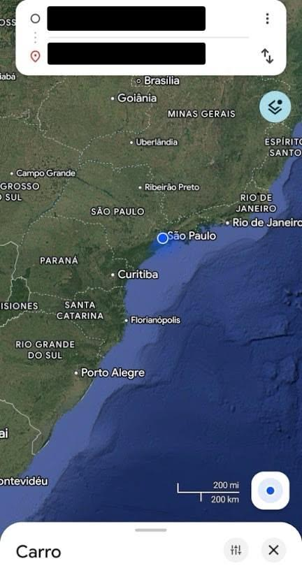
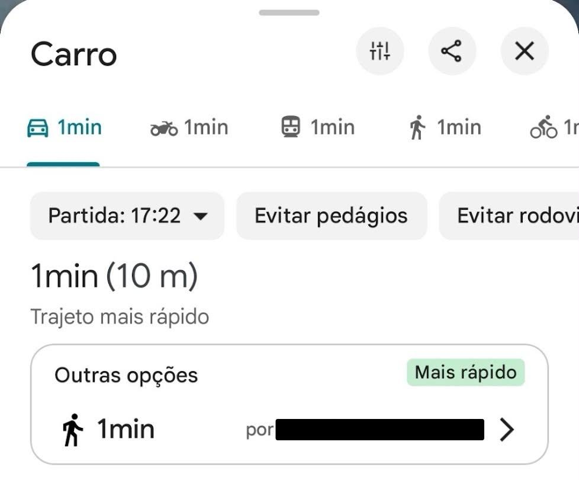

# Cadê Meu Carro? 🚗

Um aplicativo mobile desenvolvido no MIT App Inventor para ajudar o usuário a salvar a localização onde estacionou o veículo e encontrar o caminho de volta de forma simples!

> 🎓 **Projeto Académico (Legacy)**
> Este projeto foi desenvolvido originalmente durante o período universitário para fins de aprendizagem no **MIT App Inventor**.

## 📱 Screenshots do aplicativo

> **Nota:** As informações de endereço e coordenadas mostradas nas demonstrações foram ocultadas com tarjas por motivos de privacidade e proteção de dados.

## 🛠️ Tecnologias Utilizadas
* **MIT App Inventor** (Desenvolvimento em blocos de lógica)
* **Sensores de GPS / Localização**
* **Integração com mapas**

